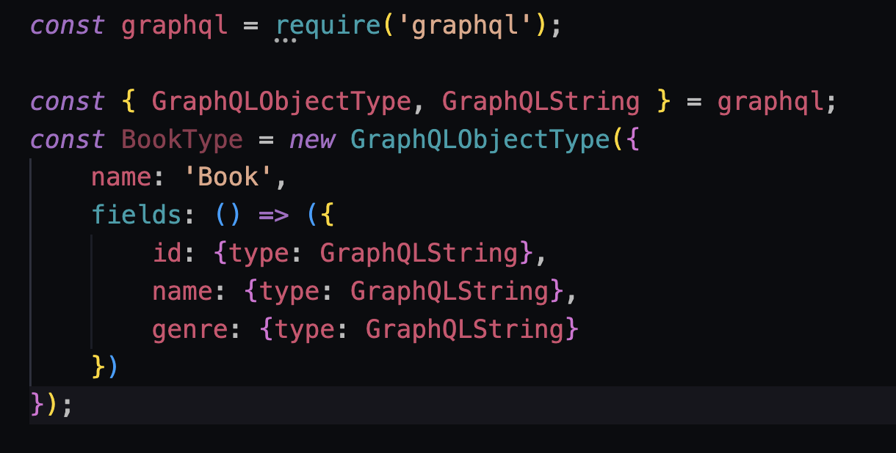
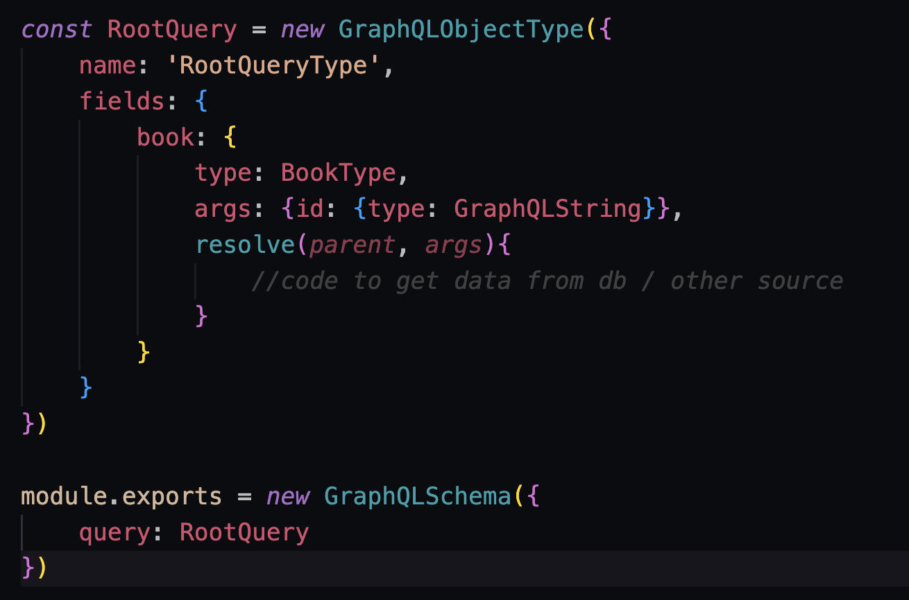

# Overview and Init:
- We will be creating a GraphQL Server on a Node.JS Express Application for our backend which will use MongoDB and mapping it to a React and Apollo frontend
- Apollo Allows you to access the GraphQL on the React side
- Graphiql is a dummy frontend for GraphQL testing

### Starting the Express Application:
```s
npm init
npm i express
npm i nodemon
```

```s
# Inital App Setup

const express = require('express')
const {graphqlHTTP} = require('express-graphql')
const schema = require('./schema/schema')

const app = express();
app.use('/graphql', graphqlHTTP({
    schema,
    graphiql: true
}))

const PORT = 4000;
app.listen(PORT, ()=>console.log(`Now listening on port: ${PORT}`))
```


