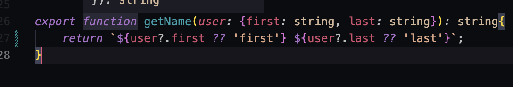

# Intro to Typescript:
***     
### To Init Typescript Project:
```s 
npm init -y # init json congi

npm i -D ts-node typescript # add these packages in devDependancies

npx tsc --init # add tsc config
```
***     
### Run TS-Node on TS file (serverless node wrapper)
```s
npx ts-node <filename>.ts
```
***
### Complile TS Code to use in JS:
```s
npx tsc <filename>.ts
```      
### Objects: 
- To declare an object multiple times without decalring types multiple times declare an interface with the types, then use inheritance to implement the type declaration.

***       
### The 'Any' Type ?!?:
- when using typescript the any type is when a variable
    is an does not have a descriptive type meaning it can be
    ANY type of variable(str, int, undefined,null). This is no BUENO! 


***     
### Functions:
- When defining a function:
```s
function addNumbers(a: number,b: number): number{
    return a + b
}
```
    * a: number - is declaring that param a will be a number
    * b: number - is the same as param a 
    * func(): number {} - the : number after the params is declaring the return type will be a number

- **String Interpolation**: 
            
    - This function concats the first and last name into a string. We can compile this TS code into JS with npx tsc <filename>.ts and we will see that we get some checking to see if the user object passed in will be null and if so implements the first and last as default values.
        * The user? is to see if the user is defined or null
        * the ?? is the teranary giving first a default option if user.first or user.last is null

***     
- *Typescript only enforces type declaration at compile time not at run time*
***     
### Importing JSON:
- Import JSON file as usual
- In TS Config:
    *  "resolveJsonModule": true,   
***   


Poke API:
https://pokeapi.co/api/v2/pokemon?limit#10